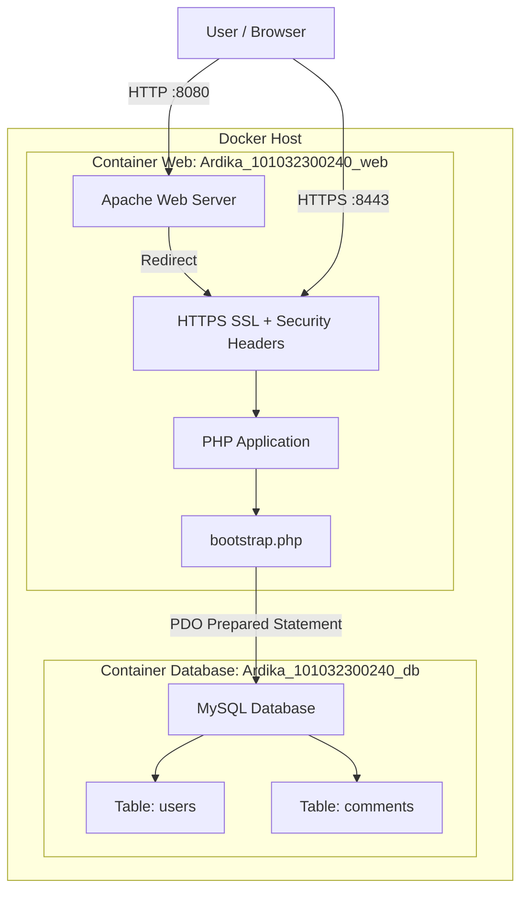
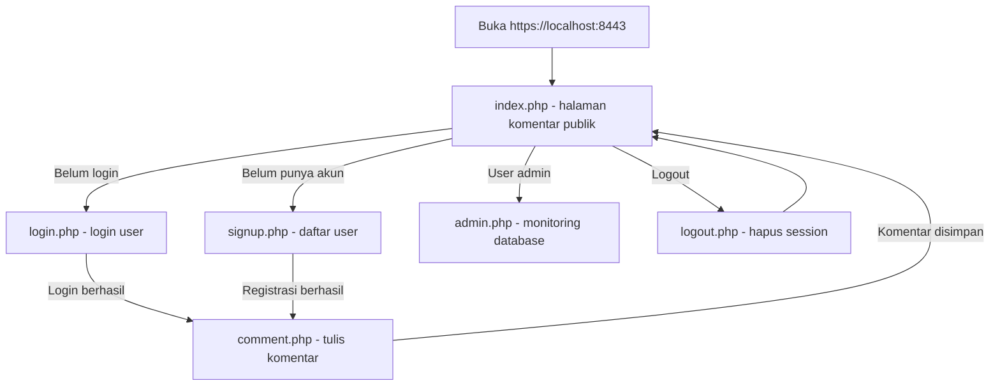
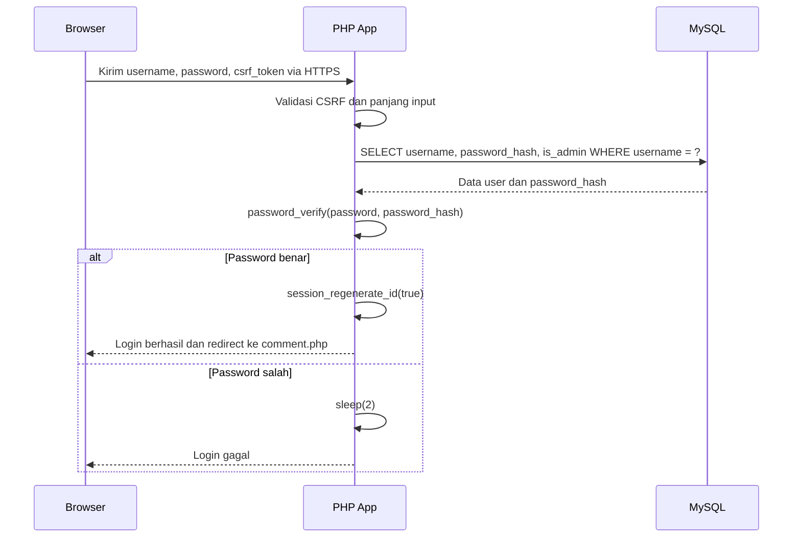

# Dokumentasi Aplikasi Currents

## 1. Ringkasan Aplikasi

Currents adalah aplikasi papan komentar publik berbasis PHP, MySQL, dan Apache yang berjalan di dalam Docker. Aplikasi ini dibuat untuk memenuhi kebutuhan tugas pengamanan aplikasi web, khususnya implementasi autentikasi, pembatasan akses, HTTPS, hashing password, perlindungan SQL injection, perlindungan XSS, dan validasi input.

Fungsi utama aplikasi:

- Pengunjung dapat membaca komentar tanpa login.
- User yang sudah login dapat menulis komentar.
- User baru dapat mendaftar melalui halaman sign up.
- Admin dapat membuka panel monitoring database.
- Password disimpan dalam bentuk hash salted, bukan plaintext.
- Query database menggunakan PDO prepared statement.
- Output komentar dan data database di-escape agar payload XSS tidak dieksekusi.

Repository memiliki dua branch penting:

- `secure-login`: versi aman untuk implementasi final.
- `vulnerable-login`: versi rentan untuk kebutuhan pembuktian SQL injection.

## 2. Teknologi Yang Digunakan

| Komponen | Teknologi |
| --- | --- |
| Web server | Apache |
| Bahasa backend | PHP 8.3 |
| Database | MySQL 8.4 |
| Koneksi database | PDO MySQL |
| Runtime | Docker Compose |
| HTTPS | Apache SSL dengan self-signed certificate |
| Frontend | HTML, CSS, JavaScript ringan |

Service Docker:

- `Ardika_101032300240_web`: container web PHP Apache.
- `Ardika_101032300240_db`: container database MySQL.

Port aplikasi:

- `https://localhost:8443`: akses HTTPS utama.
- `http://localhost:8080`: redirect ke HTTPS.

## 3. Struktur Folder

```text
CLO2/
|-- app/
|   |-- public/
|   |   |-- index.php
|   |   |-- login.php
|   |   |-- signup.php
|   |   |-- comment.php
|   |   |-- admin.php
|   |   |-- logout.php
|   |   `-- assets/
|   |       |-- styles.css
|   |       `-- app.js
|   `-- src/
|       `-- bootstrap.php
|-- docker/
|   |-- db/
|   |   `-- init.sql
|   `-- web/
|       |-- Dockerfile
|       `-- apache/
|           |-- 000-default.conf
|           `-- default-ssl.conf
|-- docker-compose.yml
`-- DOCUMENTATION.md
```

Penjelasan file utama:

- `docker-compose.yml`: mendefinisikan service web dan database.
- `docker/web/Dockerfile`: membuat image PHP Apache, mengaktifkan SSL, rewrite, headers, dan membuat sertifikat self-signed.
- `docker/web/apache/default-ssl.conf`: konfigurasi HTTPS dan security headers.
- `docker/web/apache/000-default.conf`: konfigurasi HTTP redirect ke HTTPS.
- `docker/db/init.sql`: membuat tabel `users` dan `comments`, serta seed komentar awal.
- `app/src/bootstrap.php`: konfigurasi session, koneksi database, validasi input, CSRF, autentikasi, dan helper keamanan.
- `app/public/index.php`: halaman publik untuk membaca komentar.
- `app/public/login.php`: halaman login.
- `app/public/signup.php`: halaman registrasi user.
- `app/public/comment.php`: halaman input komentar khusus user login.
- `app/public/admin.php`: panel admin untuk monitoring tabel user dan komentar.
- `app/public/logout.php`: menghapus session login.

## 4. Teori Keamanan Pemrograman

### 4.1 Confidentiality, Integrity, Availability

Keamanan aplikasi web umumnya mengikuti prinsip CIA:

- Confidentiality: data sensitif tidak boleh dibaca pihak tidak berwenang. Contohnya password tidak disimpan plaintext dan koneksi memakai HTTPS.
- Integrity: data tidak boleh dimodifikasi sembarangan. Contohnya form dilindungi CSRF token dan query database memakai prepared statement.
- Availability: aplikasi tetap dapat digunakan secara normal. Contohnya input divalidasi panjangnya agar tidak membebani sistem.

### 4.2 Authentication dan Authorization

Authentication adalah proses membuktikan identitas user, misalnya login dengan username dan password. Authorization adalah proses menentukan hak akses setelah user berhasil login.

Pada Currents:

- Login membuktikan identitas user menggunakan `password_verify()`.
- Session menyimpan status login.
- Halaman `comment.php` hanya bisa diakses user login.
- Halaman `admin.php` hanya bisa diakses user dengan role admin.

### 4.3 Password Hashing dan Salting

Password tidak boleh disimpan dalam bentuk asli. Password harus diproses menggunakan fungsi hash yang aman dan menggunakan salt.

Pada PHP, fungsi `password_hash()` sudah otomatis membuat salt unik untuk setiap password dan menyimpan informasi algoritma, cost, salt, dan hasil hash dalam satu string. Verifikasi dilakukan menggunakan `password_verify()`.

Dengan metode ini, dua user yang memakai password sama tetap menghasilkan hash yang berbeda karena salt berbeda. Jika database bocor, attacker tidak langsung mendapatkan password asli.

### 4.4 HTTPS

HTTPS melindungi data saat dikirim antara browser dan server. Tanpa HTTPS, username, password, cookie session, dan isi komentar dapat disadap di jaringan.

Currents menggunakan Apache SSL dengan sertifikat self-signed untuk host:

- `localhost`
- `127.0.0.1`
- `192.168.1.240`

Karena sertifikat self-signed, browser akan menampilkan peringatan sertifikat. Namun koneksi tetap terenkripsi setelah user menerima sertifikat tersebut.

### 4.5 SQL Injection

SQL injection terjadi ketika input user digabung langsung ke query SQL sehingga attacker dapat mengubah logika query. Contoh payload:

```text
' OR '1'='1
```

Pencegahan yang digunakan:

- Menggunakan PDO prepared statement.
- Memisahkan query SQL dan nilai input.
- Menonaktifkan emulated prepares dengan `PDO::ATTR_EMULATE_PREPARES => false`.

### 4.6 Cross-Site Scripting

XSS terjadi saat input berbahaya seperti script HTML/JavaScript ditampilkan kembali ke browser tanpa escaping. Contoh payload:

```html
<script>alert(1)</script>
```

Pencegahan yang digunakan:

- Semua output dinamis diproses memakai `htmlspecialchars()`.
- Header Content Security Policy membatasi sumber script dan resource.
- Data di admin panel juga di-escape, bukan hanya komentar publik.

### 4.7 Buffer Overflow dan Input Length Control

Pada aplikasi web modern berbasis PHP, buffer overflow tradisional jarang terjadi seperti pada bahasa C/C++. Namun input yang terlalu panjang tetap dapat menyebabkan masalah, misalnya konsumsi memori berlebih, error database, atau gangguan tampilan.

Pencegahan yang digunakan:

- Username maksimal 50 karakter.
- Password maksimal 128 karakter.
- Komentar maksimal 500 karakter.
- Kolom database juga dibatasi dengan `VARCHAR(50)` dan `VARCHAR(500)`.
- Form HTML menggunakan atribut `maxlength`.
- Server tetap melakukan validasi ulang agar tidak bergantung pada frontend.

## 5. Blok Diagram Aplikasi



## 6. Diagram Alur Halaman



## 7. Diagram Alur Login Aman



## 8. Alur Kerja Aplikasi Dari Awal Hingga Akhir

### 8.1 Menjalankan Aplikasi

Jalankan perintah berikut dari root repository:

```powershell
docker compose up -d --build
```

Docker Compose akan:

1. Build image PHP Apache dari `docker/web/Dockerfile`.
2. Mengaktifkan modul Apache `ssl`, `rewrite`, dan `headers`.
3. Membuat sertifikat self-signed.
4. Menjalankan container MySQL.
5. Membuat database `clo2_comments`.
6. Menjalankan script `docker/db/init.sql`.
7. Menjalankan aplikasi web di port `8443`.

### 8.2 Membuka Halaman Publik

User membuka:

```text
https://localhost:8443
```

Halaman `index.php` mengambil komentar dari tabel `comments`, lalu menampilkan komentar dengan escaping. Pengunjung yang belum login tetap dapat membaca komentar, tetapi tidak dapat menulis komentar.

### 8.3 Login

User membuka `login.php`, memasukkan username dan password, lalu submit form. Aplikasi melakukan:

1. Validasi CSRF token.
2. Validasi username dan panjang password.
3. Query user menggunakan prepared statement.
4. Verifikasi password dengan `password_verify()`.
5. Regenerasi ID session setelah login berhasil.
6. Redirect ke `comment.php`.

Akun demo admin:

```text
Username: admin
Password: Admin@240!
```

### 8.4 Sign Up

User dapat mendaftar melalui `signup.php`. Saat user mengisi password, frontend menampilkan syarat password secara langsung. Tombol sign up dinonaktifkan sampai syarat terpenuhi.

Syarat password:

- Minimal 8 karakter.
- Memuat huruf kecil.
- Memuat huruf besar.
- Memuat angka.
- Memuat simbol.
- Konfirmasi password harus sama.

Validasi yang sama tetap dilakukan di server melalui `password_policy_error()`. Dengan demikian, walaupun JavaScript dimatikan atau request dimanipulasi, server tetap menolak password yang tidak sesuai.

Username `admin` dan `root` tidak boleh didaftarkan dari halaman publik karena hanya akun admin yang boleh mengakses admin panel.

### 8.5 Menulis Komentar

Halaman `comment.php` dilindungi oleh `require_login()`. Jika belum login, user diarahkan ke halaman login.

Saat user mengirim komentar:

1. CSRF token diverifikasi.
2. Isi komentar dicek tidak kosong.
3. Panjang komentar dibatasi maksimal 500 karakter.
4. Komentar disimpan menggunakan prepared statement.
5. User diarahkan kembali ke halaman publik.

### 8.6 Admin Panel

Halaman `admin.php` dilindungi oleh `require_admin()`. Hanya user dengan `is_admin = 1` yang dapat mengakses panel ini.

Admin panel menampilkan:

- Total user.
- Total komentar.
- Waktu komentar terbaru.
- Status mode demo SQLi.
- Isi tabel `users`.
- Isi tabel `comments`.

Semua data tetap di-escape dengan `htmlspecialchars()`, termasuk data yang berasal dari database.

### 8.7 Logout

Logout dilakukan melalui `logout.php` dengan metode POST dan CSRF token. Setelah logout, session dihapus dan cookie session dibuat kedaluwarsa.

## 9. Desain Database

### 9.1 Tabel `users`

| Kolom | Tipe | Keterangan |
| --- | --- | --- |
| `id` | INT UNSIGNED AUTO_INCREMENT | Primary key |
| `username` | VARCHAR(50) UNIQUE | Username user |
| `password_hash` | VARCHAR(255) | Hash password salted dari `password_hash()` |
| `is_admin` | TINYINT(1) | Role admin atau user biasa |
| `created_at` | TIMESTAMP | Waktu user dibuat |

### 9.2 Tabel `comments`

| Kolom | Tipe | Keterangan |
| --- | --- | --- |
| `id` | INT UNSIGNED AUTO_INCREMENT | Primary key |
| `author` | VARCHAR(50) | Nama penulis komentar |
| `body` | VARCHAR(500) | Isi komentar |
| `created_at` | TIMESTAMP | Waktu komentar dibuat |

## 10. Penjelasan Metode Mengatasi Kerentanan Keamanan

### 10.1 HTTPS Pada Web Server

Konfigurasi berada pada:

- `docker/web/Dockerfile`
- `docker/web/apache/default-ssl.conf`
- `docker/web/apache/000-default.conf`

Implementasi:

- Apache SSL diaktifkan dengan `a2enmod ssl`.
- Sertifikat self-signed dibuat saat image dibuild.
- VirtualHost port 443 menggunakan sertifikat tersebut.
- HTTP port 8080 diarahkan ke HTTPS port 8443.

Manfaat:

- Melindungi kredensial login saat transit.
- Melindungi cookie session dari penyadapan jaringan.
- Memenuhi kebutuhan demo HTTPS pada server lokal.

### 10.2 Salting dan Hashing Password

Implementasi berada pada:

- `app/src/bootstrap.php`
- `app/public/signup.php`
- `app/public/login.php`

Metode:

- Password user baru diproses dengan `password_hash($password, PASSWORD_DEFAULT)`.
- Salt dibuat otomatis oleh PHP.
- Login diverifikasi dengan `password_verify($password, $password_hash)`.
- Password asli tidak disimpan pada database pada mode aman.

Catatan: pengiriman data login diamankan menggunakan HTTPS. Salting dan hashing dilakukan di sisi server sebelum password disimpan ke database. Ini lebih aman dan lebih sesuai praktik umum dibanding membuat hash client-side yang masih dapat dicuri dan dipakai ulang sebagai credential.

### 10.3 Pencegahan SQL Injection

Implementasi:

```php
$stmt = db()->prepare('SELECT username, password_hash, is_admin FROM users WHERE username = :username LIMIT 1');
$stmt->execute(['username' => $username]);
```

Dan:

```php
$stmt = db()->prepare('INSERT INTO comments (author, body) VALUES (:author, :body)');
$stmt->execute([
    'author' => current_user(),
    'body' => $body,
]);
```

Metode:

- Query SQL tidak digabung langsung dengan input user.
- Input dikirim sebagai parameter.
- PDO native prepared statement digunakan dengan `PDO::ATTR_EMULATE_PREPARES => false`.

Hasil:

- Payload seperti `' OR '1'='1` dianggap sebagai string biasa.
- Attacker tidak dapat mengubah struktur query SQL.

### 10.4 Pencegahan Buffer Overflow dan Input Berlebihan

Implementasi:

- `MAX_USERNAME_LENGTH = 50`
- `MAX_PASSWORD_LENGTH = 128`
- `MAX_COMMENT_LENGTH = 500`
- Validasi melalui `strlen()`.
- Kolom database juga dibatasi panjangnya.
- Form HTML memakai `maxlength`.

Hasil:

- Input kosong ditolak.
- Input terlalu panjang ditolak.
- Database tidak menerima data melebihi ukuran yang dirancang.

### 10.5 Pencegahan XSS

Implementasi:

```php
function h(?string $value): string
{
    return htmlspecialchars($value ?? '', ENT_QUOTES | ENT_SUBSTITUTE, 'UTF-8');
}
```

Semua output user dan database ditampilkan menggunakan `h()`.

Contoh:

```php
<?= h((string) $comment['body']) ?>
```

Selain escaping, aplikasi juga mengirim header:

```text
Content-Security-Policy: default-src 'self'; style-src 'self'; form-action 'self'; base-uri 'self'; frame-ancestors 'none'
```

Hasil:

- Payload `<script>alert(1)</script>` tampil sebagai teks.
- Script tidak dijalankan browser.
- Admin panel tetap aman walaupun database berisi payload XSS.

### 10.6 Session Security

Implementasi:

- Cookie session memakai `HttpOnly`.
- Cookie session memakai `Secure` saat HTTPS aktif.
- Cookie session memakai `SameSite=Strict`.
- `session.use_strict_mode = 1`.
- `session.use_only_cookies = 1`.
- `session_regenerate_id(true)` dipanggil setelah login berhasil.

Manfaat:

- Mengurangi risiko pencurian cookie lewat JavaScript.
- Mengurangi risiko CSRF lintas situs.
- Mengurangi risiko session fixation.

### 10.7 CSRF Protection

Setiap form sensitif memiliki token:

- Login.
- Sign up.
- Tambah komentar.
- Logout.

Token dibuat dengan:

```php
bin2hex(random_bytes(32))
```

Verifikasi token menggunakan:

```php
hash_equals(csrf_token(), $token)
```

Manfaat:

- Request palsu dari situs lain tidak dapat menjalankan aksi penting tanpa token session yang valid.

### 10.8 Brute Force Mitigation

Login gagal diberi delay tetap:

```php
sleep(FAILED_LOGIN_DELAY_SECONDS);
```

Dengan nilai:

```php
FAILED_LOGIN_DELAY_SECONDS = 2
```

Manfaat:

- Percobaan password berulang menjadi lebih lambat.
- Mudah dibuktikan menggunakan Burp Suite Intruder karena setiap login gagal terasa memiliki jeda.

### 10.9 Security Headers

Apache mengirim beberapa header keamanan:

| Header | Fungsi |
| --- | --- |
| `X-Content-Type-Options: nosniff` | Mencegah MIME sniffing |
| `X-Frame-Options: DENY` | Mencegah clickjacking |
| `Referrer-Policy: same-origin` | Membatasi kebocoran referrer |
| `Permissions-Policy` | Mematikan akses kamera, mikrofon, lokasi |
| `Cross-Origin-Opener-Policy: same-origin` | Memisahkan browsing context lintas origin |
| `Strict-Transport-Security` | Memaksa HTTPS setelah dipercaya browser |
| `Content-Security-Policy` | Membatasi sumber konten dan mencegah script tidak sah |

## 11. Pemetaan Instruksi Tugas Dengan Implementasi

| Instruksi tugas | Status | Implementasi |
| --- | --- | --- |
| Konfigurasikan HTTPS pada web server | Sudah | Apache SSL, self-signed certificate, port 8443 |
| Beri teknik salting pada data login/password | Sudah | `password_hash()` otomatis membuat salt unik |
| Beri fungsi hash pada data password | Sudah | `password_hash()` dan `password_verify()` |
| Amankan input dari SQL injection | Sudah | PDO prepared statement |
| Amankan input dari buffer overflow | Sudah | Batas panjang input dan kolom database |
| Amankan web dari XSS scripting | Sudah | `htmlspecialchars()` dan CSP |
| Batasi akses fitur tulis komentar | Sudah | `require_login()` |
| Batasi admin panel untuk admin/root | Sudah | `require_admin()` dan `is_admin` |

## 12. Rencana Pengujian

### 12.1 Test HTTPS

1. Jalankan aplikasi.
2. Buka `https://localhost:8443`.
3. Browser menampilkan peringatan self-signed certificate.
4. Setelah diterima, halaman tampil melalui HTTPS.

Ekspektasi:

- Aplikasi terbuka di HTTPS.
- Response header memuat security headers.

### 12.2 Test Public Read

1. Logout dari aplikasi.
2. Buka halaman utama.

Ekspektasi:

- Komentar tetap dapat dibaca.
- Tombol login dan sign up tersedia.
- Form tulis komentar tidak tersedia di halaman publik.

### 12.3 Test Login

Gunakan akun:

```text
admin / Admin@240!
```

Ekspektasi:

- Login berhasil.
- User diarahkan ke halaman tulis komentar.
- Admin dapat membuka admin panel.

### 12.4 Test Sign Up

1. Buka `signup.php`.
2. Masukkan password yang belum memenuhi syarat.
3. Perhatikan tombol sign up tetap disabled.
4. Lengkapi syarat password.

Ekspektasi:

- Syarat password ditampilkan real-time.
- User baru berhasil dibuat setelah validasi terpenuhi.
- User baru tidak dapat membuka admin panel.

### 12.5 Test SQL Injection

Masukkan payload pada username atau password:

```text
' OR '1'='1
```

Ekspektasi pada branch `secure-login`:

- Login gagal.
- Payload dianggap string biasa.

Ekspektasi pada branch `vulnerable-login`:

- Payload dapat digunakan untuk demonstrasi kerentanan sesuai kebutuhan pembuktian.

### 12.6 Test XSS

Login, lalu kirim komentar:

```html
<script>alert(1)</script>
```

Ekspektasi:

- Browser menampilkan teks payload.
- Tidak ada alert JavaScript.
- Admin panel juga menampilkan payload sebagai teks.

### 12.7 Test Buffer Length

Kirim komentar lebih dari 500 karakter.

Ekspektasi:

- Server menolak input.
- Komentar tidak tersimpan.

### 12.8 Test Brute Force Delay

Lakukan login gagal beberapa kali.

Ekspektasi:

- Setiap percobaan gagal memiliki jeda sekitar 2 detik.

## 13. Perintah Operasional

Menyalakan aplikasi:

```powershell
docker compose up -d --build
```

Melihat status container:

```powershell
docker compose ps
```

Melihat log:

```powershell
docker compose logs -f web
docker compose logs -f db
```

Masuk ke database:

```powershell
docker compose exec db mysql -uclo2_user -pclo2_password clo2_comments
```

Query contoh:

```sql
SELECT id, username, is_admin, created_at FROM users;
SELECT id, author, body, created_at FROM comments ORDER BY created_at DESC;
```

Mematikan aplikasi:

```powershell
docker compose down
```

Mematikan aplikasi dan menghapus volume database:

```powershell
docker compose down -v
```

## 14. Kesimpulan

Currents sudah mengimplementasikan kebutuhan utama pengamanan aplikasi web: HTTPS, hashing dan salting password, prepared statement untuk SQL injection, validasi input untuk membatasi ukuran data, escaping output untuk XSS, session cookie aman, CSRF token, security headers, serta pembatasan akses berdasarkan login dan role admin.

Aplikasi ini juga mendukung skenario pembelajaran keamanan melalui pemisahan branch `secure-login` dan `vulnerable-login`, sehingga demonstrasi kerentanan dan perbaikannya dapat dibandingkan dengan jelas.
